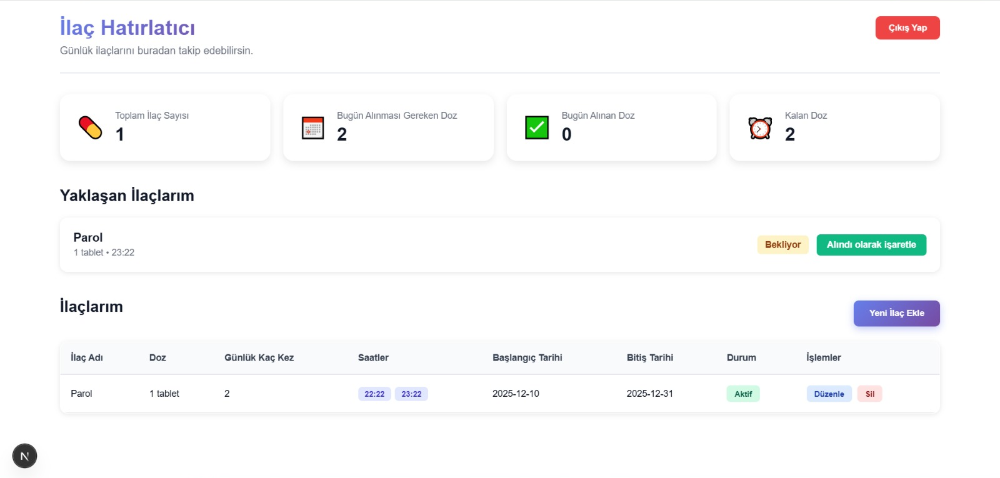
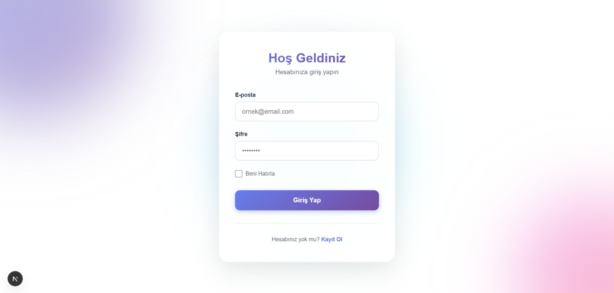
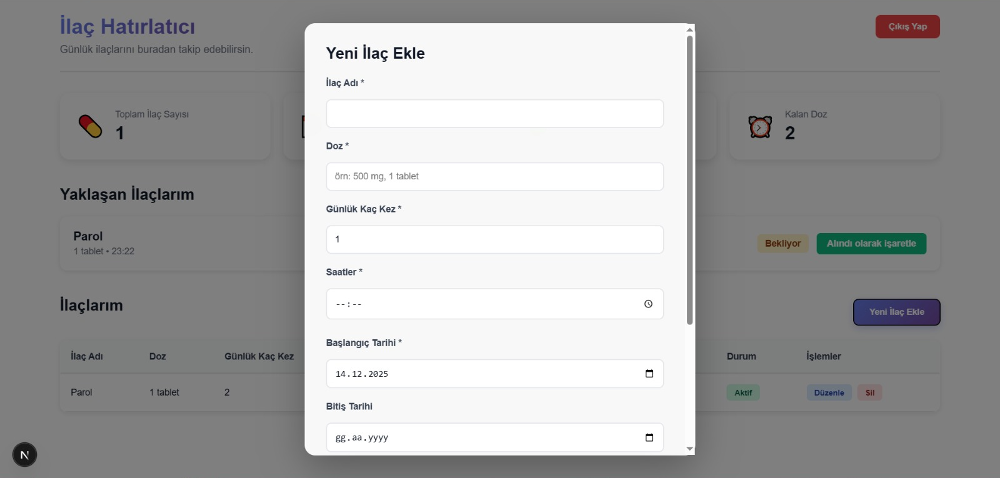

# 💊 Kolay Hatırla - İlaç Takip Uygulaması

Modern ve kullanıcı dostu bir web uygulaması ile günlük ilaçlarınızı takip edin, dozlarınızı yönetin ve hiçbir ilacı unutmayın.



## İçindekiler

- [Özellikler](#-özellikler)
- [Ekran Görüntüleri](#-ekran-görüntüleri)
- [Kurulum](#-kurulum)
- [Kullanım](#-kullanım)
- [Teknolojiler](#-teknolojiler)
- [Proje Yapısı](#-proje-yapısı)

## Özellikler

### Güvenli Kullanıcı Sistemi
- Email ve şifre ile kayıt olma
- Güvenli giriş yapma
- Oturum yönetimi (giriş yapınca hatırlanır)

### İlaç Yönetimi
-  Yeni ilaç ekleme
-  Mevcut ilaçları düzenleme
-  İlaç silme
-  İlaçları aktif/pasif yapma (geçici olarak durdurma)
-  İlaç notları ekleme

### Doz Takibi
-  Günlük istatistikler (toplam, alınan, kalan dozlar)
-  Yaklaşan ilaçlar (3 saat içinde alınması gerekenler)
-  "Alındı" işaretleme
-  Gerçek zamanlı güncellemeler

###  Modern Arayüz
-  Dark mode desteği (sistem tercihine göre)
-  Responsive tasarım (mobil, tablet, masaüstü uyumlu)
-  Kullanıcı dostu arayüz
-  Hızlı ve performanslı

##  Ekran Görüntüleri

### 1. Giriş Sayfası
Modern ve şık tasarıma sahip giriş sayfası. Gradient arka plan ve kullanıcı dostu form yapısı ile kolay giriş yapabilirsiniz.



### 2. Dashboard (Ana Sayfa)
Tüm ilaçlarınızı tek bakışta görebileceğiniz, istatistiklerinizi takip edebileceğiniz ana kontrol paneli.


### 3. Yeni İlaç Ekleme
Kolay ve hızlı ilaç ekleme formu. İlaç bilgilerini, dozajını, saatlerini ve tarihlerini kolayca girebilirsiniz.



##  Kurulum

### Gereksinimler

- Node.js 18.17 veya üzeri
- npm veya yarn
- Firebase hesabı ve proje

### Adım 1: Projeyi İndirin

```bash
git clone <repository-url>
cd kolay-hatirla-main
```

### Adım 2: Bağımlılıkları Yükleyin

```bash
npm install
```

### Adım 3: Environment Variables Oluşturun

Proje kök dizininde `.env.local` dosyası oluşturun ve Firebase bilgilerinizi ekleyin:

```env
NEXT_PUBLIC_FIREBASE_API_KEY=
NEXT_PUBLIC_FIREBASE_AUTH_DOMAIN=y
NEXT_PUBLIC_FIREBASE_PROJECT_ID=
NEXT_PUBLIC_FIREBASE_STORAGE_BUCKET=
NEXT_PUBLIC_FIREBASE_MESSAGING_SENDER_ID=
NEXT_PUBLIC_FIREBASE_APP_ID=
```

**Firebase bilgilerinizi nereden alırsınız?**
1. [Firebase Console](https://console.firebase.google.com/) adresine gidin
2. Projenizi seçin
3. Ayarlar > Proje ayarları
4. "Uygulamalarınız" bölümünden web uygulamanızı seçin
5. Config bilgilerini kopyalayın

### Adım 4: Uygulamayı Çalıştırın

```bash
npm run dev
```

Tarayıcınızda [http://localhost:3000](http://localhost:3000) adresine gidin.

##  Kullanım

### İlk Kullanım

1. **Kayıt Olun**
   - Ana sayfada "Kayıt Ol" linkine tıklayın
   - Ad, email ve şifre bilgilerinizi girin
   - "Kayıt Ol" butonuna tıklayın

2. **İlk İlacınızı Ekleyin**
   - Dashboard'da "Yeni İlaç Ekle" butonuna tıklayın
   - İlaç bilgilerini doldurun:
     - İlaç adı
     - Doz bilgisi (örn: 500 mg, 1 tablet)
     - Günlük kaç kez alınacağı
     - Saatler (örn: 08:00, 14:00, 20:00)
     - Başlangıç ve bitiş tarihleri
     - Notlar (opsiyonel)
   - "Kaydet" butonuna tıklayın

3. **İlaçlarınızı Takip Edin**
   - Dashboard'da günlük istatistiklerinizi görün
   - "Yaklaşan İlaçlarım" bölümünden önümüzdeki 3 saat içindeki ilaçları kontrol edin
   - İlacı aldığınızda "Alındı olarak işaretle" butonuna tıklayın

### Günlük Kullanım

- Dashboard'u açın
- Bugünkü istatistiklerinizi kontrol edin
- Yaklaşan ilaçlarınızı görün
- İlaç aldığınızda işaretleyin
- İlaç eklemek, düzenlemek veya silmek için ilgili butonları kullanın

## Teknolojiler

Bu proje aşağıdaki teknolojiler kullanılarak geliştirilmiştir:

- **[Next.js 16.0.8](https://nextjs.org/)** - React framework
- **[React 19.2.1](https://react.dev/)** - UI library
- **[TypeScript 5](https://www.typescriptlang.org/)** - Type-safe JavaScript
- **[Firebase 12.6.0](https://firebase.google.com/)** - Backend (Authentication & Firestore)
- **CSS3** - Styling (Vanilla CSS)

## Proje Yapısı

```
kolay-hatirla-main/
├── docs/
│   └── images/              # Ekran görüntüleri
├── public/                  # Statik dosyalar
├── src/
│   ├── app/                 # Next.js sayfaları
│   │   ├── auth/           # Giriş ve kayıt sayfaları
│   │   ├── dashboard/      # Ana kontrol paneli
│   │   └── layout.tsx      # Root layout
│   ├── lib/                 # İş mantığı
│   │   ├── firebase.ts     # Firebase konfigürasyonu
│   │   └── medications.ts  # İlaç işlemleri
│   ├── styles/              # CSS dosyaları
│   └── types/               # TypeScript tip tanımları
├── .env.local               # Environment variables (oluşturulmalı)
├── next.config.ts          # Next.js konfigürasyonu
├── package.json            # Bağımlılıklar
└── tsconfig.json           # TypeScript konfigürasyonu
```

## Geliştirme

### Geliştirme Modu

```bash
npm run dev
```

### Production Build

```bash
npm run build
npm run start
```

### Kod Kontrolü

```bash
npm run lint
```

## Scripts

| Komut | Açıklama |
|-------|----------|
| `npm run dev` | Geliştirme sunucusunu başlatır (port 3000) |
| `npm run build` | Production için build oluşturur |
| `npm run start` | Production sunucusunu başlatır |

